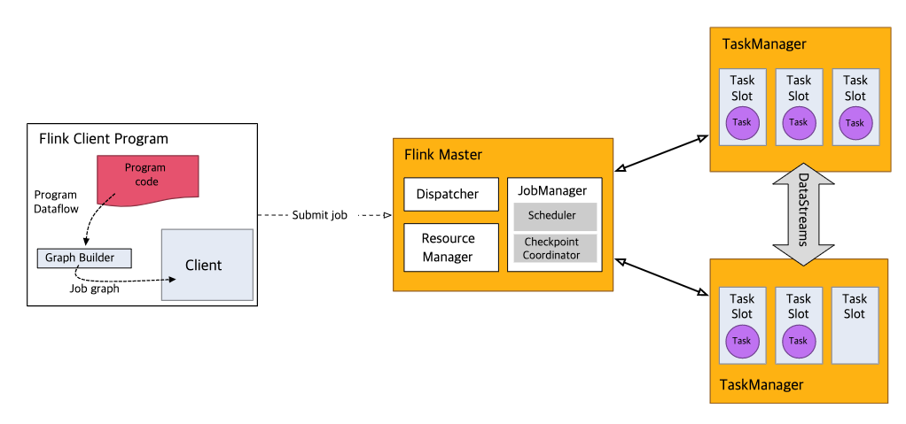

# Intro
- streaming application을 만드는 데에 적합

# Stream이 될 수 있는 것
## Basic Types
- String, Long, Integer, Bollean, Array
- Composite Types: Tuples, POJOs, Scala case classes

# StreamExecutionEnvironment
- 모든 Flink Application은 실행 환경을 갖는다.
- Streaming Application은 StreamingExecutionEnvironment 를 사용해야 한다.
## 실행 과정
1. App 내에서 DataStream API를 call하면 Job Graph가 Build되고, StreamExecutionEnvironment에 attach된다.
1. env.execute()가 call되면 이 graph가 package되어 JobManager로 보내진다.
1. JobManager는 해당 job을 병렬화하고 실행을 위해 job의 slice를 Task Manager에 분배한다.
1. 각 병렬 slice job은 하나의 task slot에서 실행될 것이다.
