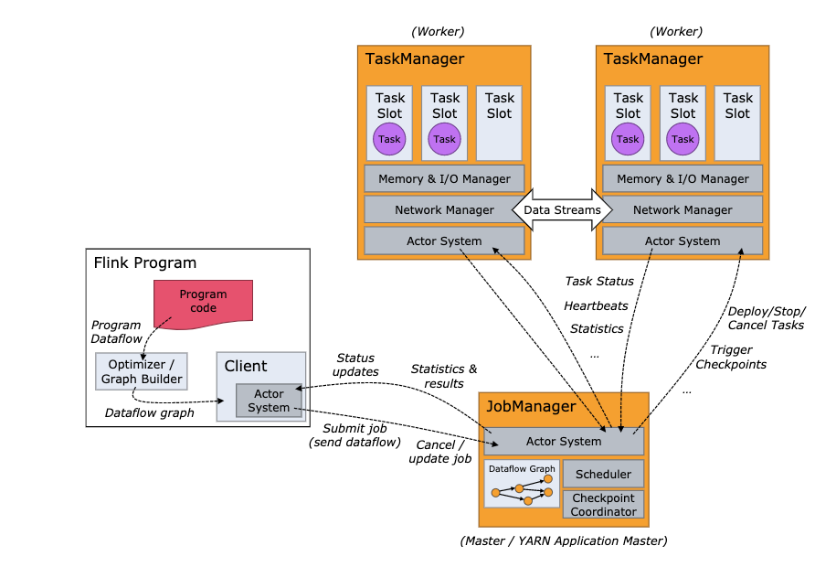

# Flink Architecture
- 분산 시스템으로서, streaming application을 실행하기 위해 computing resource를 효과적으로 할당, 관리해야 한다.
- hadoop yarn, mesos, k8s 등과 `통합될 수`도 있고 `단독으로 설치되어 실행`되거나 `Library로서 사용도 가능`하다.

# Process
- Flink Runtime은 하나의 JobManager와, N개의 TaskManager로 구성된다.
- Client는 `runtime과 프로그램 실행의 일부는 아니`며, dataflow 준비 및 JobManager로의 전송에 사용된다.
    - attach mode client: 진행 상황 report 수신을 위한 connection 유지
    - detach mode client: dataflow 전달 이후 disconnect
- Client는 java/scalla program이나 command line process(bin/flink run)으로 trigger된다.

## JobManager
- FLink Application의 분산 실행을 조정하는 역할 담당(bin/start-cluster.sh)
    - 다음 Task 스케줄링 및 설정
    - Task 성공 및 실패에 대한 대응
    - Checkpoint 조정
    - 장애 복구 조정
- 최소한 하나의 JobManager가 있어야 한다.(HA를 위해 leader, standby로 구성 )
- 다음 세 가지 컴포넌트로 구성된다.
### ResourceManager
- Flink cluster에서 Resource 제거, 할당, provisioning을 담당
- task slot(flink cluster에서 resource scheduling을 담당) 관리
- Flink는 각 환경, resource provider에 따른 다수의 ResourceManager를 구현한다.(k8s, mesos, standalone 등)
- standalone setup에서는 `사용 가능한 TaskManager의 Slot만 배포할 수 있으며`, `새로운 TaskManager를 단독으로 시작할 수 없다.`

### Dispatcher
- 실행을 위한 Flink Application을 제출하는 `REST interface 제공` 및 제출된 `각 Job을 위한 새로운 JobMaster 실행`
- job execution에 대한 정보를 제공하는 Flink WebUI 실행

### JobMaster
- JobGraph 실행 관리
- 다수의 Job을 Flink Cluster에서 동시에 실행할 수 있으며, `각 Job에는 고유 JobMaster가 있다.`

## TaskManager(Worker)
- dataflow, buffer의 task 실행 및 data stream 교환
- 하나 이상의 TaskManager가 있어야 하며, 가장 작은 단위는 task slot
- task slot의 수는 concurrent processing task의 수를 나타냄
- 다수의 operator가 하나의 task slot에서 실행될 수 있다.

## Task and Operator Chains
- 분산 실행을 위해 Flink는 operator subtask를 task로 연결하며 각 task는 하나의 thread에서 실행된다.
    - thread 간 handover, buffering의 overhead 감소
    - latency 감소
    - 전반적인 throughput 증가
