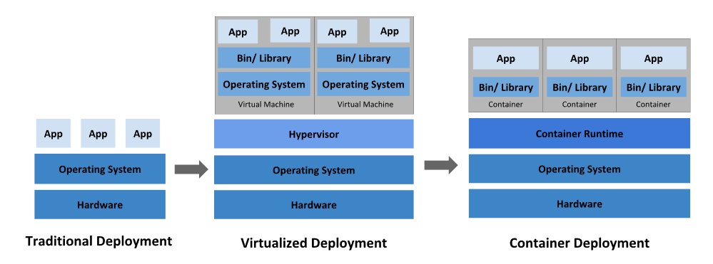

# 개요
- 컨테이너화된 서비스 관리를 위한 이식성 있고, 확장이 가능한 플랫폼
- Declarative configuration과 Automation을 용이하게 해준다.

- Physical Machine -> Virtual Machine -> Containerized Deployment Environment
## Container의 장점
- VM이미지보다 Container 이미지 생성이 쉬움
- CI/CD, Rollback이 쉬움
- 개발과 운영의 관심사 분리: 배포 시점이 아닌 빌드/릴리스 시점에 애플리케이션 컨테이너 이미지를 만들기 때문에, 애플리케이션이 인프라스트럭처에서 분리된다??
- App의 Healath, 추가적인 시그널 등을 확인하기 용이
- 환경을 일정하게 유지하여 각 phase 배포 가능 -> 어디서든 쉽게 구동 가능
- Loosely coupled, Distributed, Elastic, Liberated MSA

## Kubernetes의 역할
- Service Discovery & Load Balancing
    - DNS 명, 자체 IP 주소 등으로 컨테이너를 노출할 수 있다.
    - Load Balancing 지원으로 인한 안정적인 배포
- Storage Orchestration
    - Local Storage, public cloud providers 같은 Storage를 자동으로 탑재
- Auto Roll-out, Roll-back
    - Kubernetes를 자동화하여 배포용 컨테이너 생성, 기존 컨테이너 제거, 모든 리소스를 새 컨테이너에 적용하는 등의 행위가 용이
- Self-healing
    - Faield Container 재시작 또는 교체
    - user-defined health check에 응답하지 않는 컨테이너 Kill
    - 서비스 준비 전까지 클라이언트에 노출하지 않음
- Auto bin-packing
    - Cluster화하면 각 컨테이너가 필요로 하는 Resource를 Kubernetes에 지시
    - Container를 Node에 맞추어서 Resource를 가장 잘 사용할 수 있게 함
- Secret, Configuration management
    - Password, OAuth Token, SSH Key 등의 정보 저장 및 관리

## Kubernetes Components
- `Cluster는 Node의 집합`이며, Kubernetes는 `하나 이상의 Worker Node로 구성`
- Cluster는 fault-tolerance, HA 제공
### Worker Node
- Pod를 Hosting
### Control Plane Component(보통 Master Node Component)
- Worker Node와 Cluster 내 Pod 관리
- 여러 Physical Machine에 걸쳐 실행된다.
- Cluster에 관한 전반적인 결정 수행(Scheduling 등)
- Cluster Event를 감지 및 반응(replicas 수 충족 등)
- Cluster 내 어떠한 머신에서도 동작할 수 있다.
#### Kube-apiserver
- Kubernetes Control Plane의 FE
- Kubernetes API를 노출하는 Component
#### etcd
- key, value storage
- HA 보장
#### Kube-scheduler
- Node가 배정되지 않은 새로 생성된 Pod 감지 및 실행할 Node 선택
- hw, sw, policy constraint, resource 요구사항, `affinity & anti-affinity 명세`, data locality, inter-workload interference, deadlines 포함
#### Kube-controller-manager
- Controller를 구동하는 Master상의 Component
- 각 Controller는 개별 프로세스이지만, single binary로 compile, single process 내에서 실행 -> 복잡성을 낮춤
- 아래 Controller 포함
    - Node Controller: Node Down시 notice, response
    - Replication Controller: 알맞은 파드 수 유지
    - End-point Controller: Service - Pod 연결
    - Service Account, Token Controller: 새로운 Namespace에 대한 기본 계정, API access token 생성
#### Cloud-controller-manager
- Cloud 별 Control Logic을 내장한 Component
- Cloud Provider의 API에 연결
- 해당 Cloud Platform과 상호 작용하는 Component, Cluster와 상호 작용하는 Component로 분리됨
- Cloud Provider 전용 Controller만 실행
- 자신의 사내 또는 PC 내부의 학습 환경에서 쿠버네티스를 실행 중인 경우 클러스터에는 클라우드 컨트롤러 매니저가 없다.(?)

### Node Component
- 동작 중인 Pod 유지 및 Kubernets Run-time Environment 제공
- 모든 Node 상에서 동작
#### kubelet
- 각 Node에서 실행되는 Agent
- Pod 내 Container가 PodSpec에 따라 확실하게 동작하도록 관리
#### kube-proxy
- 각 Node에서 실행되는 Network Proxy
- Service의 Implement
- Node의 network 규칙을 유지, 관리 및 이 규칙이 내부 Network Seession, Cluster 외부 Pod로 Network 통신할 수 있도록 한다.
- OS에 가용 패킷 필터링 계층이 있는 경우 사용 or traffic 자체 forward -> ??

#### Container Runtime
- Container 실행을 담당하는 SW
- Kubernetes Runtime Interface(CRI)를 구현한 모든 Container runtime 지원
- Docker를 Deprecate하고 containerd를 주로 사용할 예정 -> 레이어 감소

### Add-on
- Kubernetes Resource(Daemonset, Deplomyent 등)을 이용, 클러스터 기능 구현
- Cluster 단위의 기능을 제공하므로 Add-on에 대한 Namespace resource는 kube-system에 속함
#### DNS
- 반드시 필요한 Add-on
- Cluster DNS는 구성환경 내의 다른 DNS server와 Kubernetes Service를 위해 DNS Record를 제공
#### Web UI(대시보드)
- lens가 나음
#### Container Resource Monitoring
- DB 내 Container에 대한 generic time series Metric 기록 및 열람 UI 제공
#### Cluster Level Logging
- Log 저장소에 Container 로그 저장

## Kubernetes API
- Control Plane의 핵심
- End-User, Cluster의 다른 부분(타 노드?), 외부 Component가 통신할 수 있게 HTTP API 제공
