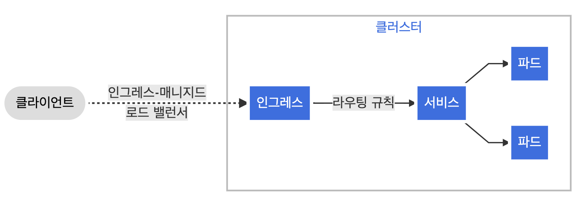

# Intro
- Cluster 내 Service에 대한 외부 접근을 관리하는 API
- 일반적으로 HTTP 관리
- Load Balancing, SSL 종료, 명칭 기반의 가상 호스팅을 제공
- Cluster외부에서 클러스터 내부 서비스로 들어올 수 있는 HTTP, HTTPS Expose
- Ingress Controller가 LB를 사용하여 Ingress를 수행할 책임이 있다.(필수, ex-ingress-nginx)
- Traffic 처리를 돕기 위해 Edge Router 또는 추가 FE를 구성할 수도 있다.


# Resource Definition
```yaml
apiVersion: networking.k8s.io/v1
kind: Ingress
metadata:
  name: minimal-ingress
  annotations:
    nginx.ingress.kubernetes.io/rewrite-target: /
spec:
  rules:
  - http:
      paths:
      - path: /testpath
        pathType: Prefix
        backend:
          service:
            name: test
            port:
              number: 80

```