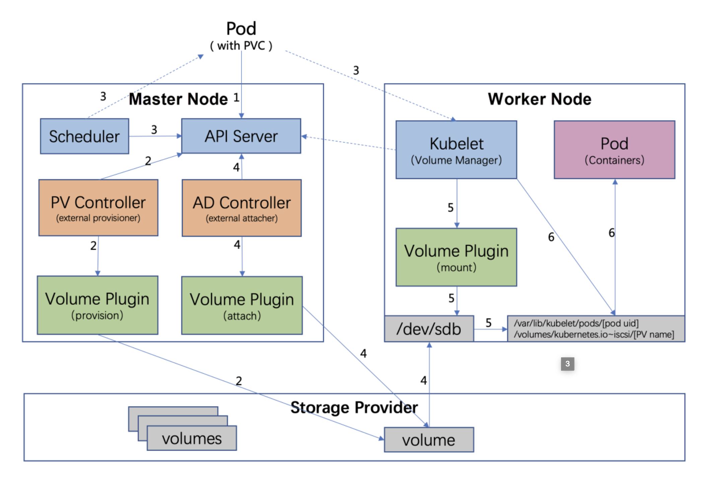
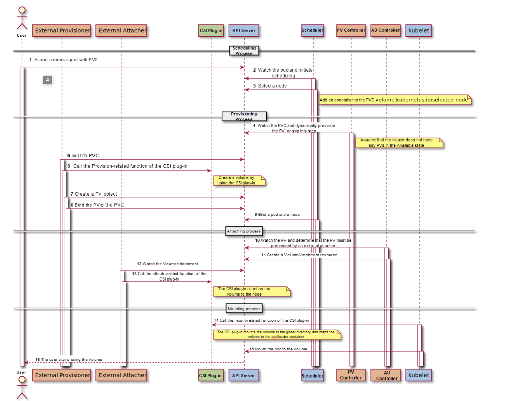
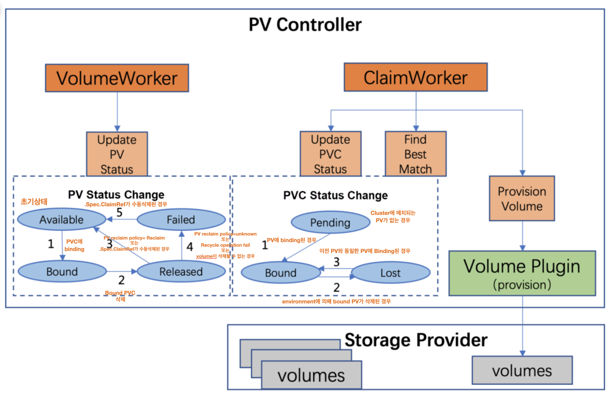
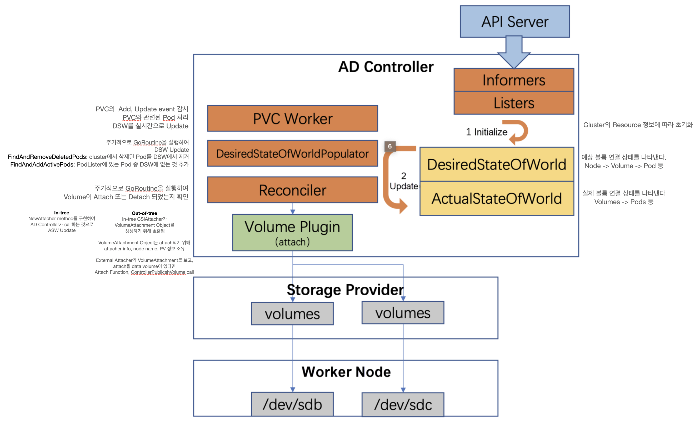

# Persistent Volume Controller
- PV와 PVC를 binding하며, lifecycle을 관리
- data volume에 대한 provisioning, deleting도 수행
- Volume plugin function을 직접 call할 수는 없으며, gRPC 통신을 통해 External Provisioner가 수행한다.

## OVERVIEW

1. user가 PVC를 참조하는 Pod를 생성(Dynamic PV의 경우)
1. scheduler가 적절한 node에 Pod 할당
1. PVController는 PVC가 PENDING인지 확인 후, Volume Plugin을 call하여 PV, PV Object를 생성
1. ADController는 To Be Attached 상태의 Pod와 PVC를 감지하고, target worker node에 storage device를 attach하기 위해 Volume Plugin을 call한다.
1. worker node에서는 `kubelet의 volume manager`는 storage device가 attach될 때까지 기다리고, Volume Plugin을 사용하여 device를 `global directory`인 `/var/lib/kubelet/pods/[pod uid]/volumes/kubernetes.io~iscsi(iscsi를 사용한 경우)/[PVname]`에 mount한다.
1. kubelet이 Docker를 통해 Container를 생성, `bind mount 방식`으로 local-global directory에 mount된 volume을 container에 mapping

## PV controller Component

- VolumeWorker: PV의 상태 변경 처리
- ClaimWorker: PVC의 CRD 이벤트, 상태 변경 처리 및 Best Match 탐색, Volume Provision

# Provisioning Volume
## Static Volume Process
- PV Controller가 Available 상태의 PV를 선택해서 새 PVC와 Match한다.
### DelayBinding
- PV Controller가 PVC를 Binding할지 여부를 결정
- PVC annotation 중 `volume.kubernetes.io/selected-node`이 있는지 확인
    - 존재 -> scheduler에 의해 node에 scheduling(Binding이 delay되지 않음)
    - 존재하지 않음
        - StorageClass 존재 -> VolumeBindingMode field 확인, WaitForFirstConsumer이면 Delay, Immediate이면 Delay되지 않음
        - StorageClass 존재하지 않음 -> Binding이 delay되지 않음

### FindBestMatchPVForClaim
- PV Controller가 환경에서 PVC와 match되는 PV를 찾는다.
- 모든 PV를 순회, 후보 중 최적의 PV를 선택
- PV Controller의 Filter Rules
    1. VolumeMode Match 확인
    1. PV가 PVC에 binding되었는지 확인
    1. PV의 Status Phase가 Available인지 확인
    1. LabelSelector를 통해 PV와 PVC가 동일 label인지 확인
    1. PV와 PVC가 동일 StorageClass인지 확인
    1. 요청 크기를 충족하는 최소한의 PV를 Update, 결과 반환
### Bind
- PV Controller가 선택된 PV를 PVC에 binding
    1. PV의 .Spec.ClaimRef가 현재 PVC로 update
    1. PV의 .Status.Phase가 Bound로 update
    1. `pv.kubernetes.io/bound-by-controller: "yes"`가 PV에 추가
    1. PVC의 .Spec.VolumeName가 PV명으로 update
    1. PVC의 .Status.Phase가 Bound로 update
    1. `pv.kubernetes.io/bound-by-controller: "yes" / pv.kubernetes.io/bind-completed: "yes"`가 PVC에 추가
## Dynamic Volume Process
- cluster에 적절한 PV가 없는 경우 처리

### Before Provisioning
1. PVC에서 사용되는 StorageClass가 in-tree인지 out-of-tree인지 결정
    - StorageClass의 Provisioner field가 `kubernetes.io/` prefix를 포함하는지 확인
1. `claim.Annotations["volume.beta.kubernetes.io/storage-provisioner"] = storageClass.Provisioner`로 PVC annotaton update
### In-tree Provisioning(Internal Provisioning)
1. in-tree provisioner가 ProvisionableVolumePlugin의 NewProvisioner method 구현 및 return
1. PV controller가 PV object를 return하기 위해 provisioner의 Provision Function call
1. PV Controller가 반환된 PV Object를 생성하여 PVC에 Binding
    - .Spec.ClaimRef=PVC, .Status.Phase=Bound, .Spec.StorageClassName=PVC의 storageClassName으로 설정
    - "pv.kubernetes.io/bound-by-controller"="yes" "pv.kubernetes.io/provisioned-by"=plugin.GetPluginName()" annotation 추가
### Out-of-tree Provisioning(External Provisioning)
1. External Provisioner가 PVC의 claim.Spec.VolumeName이 비어있는지 확인(비어있다면 PVC가 skip된다)
1. PVC의 `claim.Annotations["volume.beta.kubernetes.io/storage-provisioner"]`이 Provisioner의 것과 동일한지 확인
1. startup시에 External Provisioner가 `--provisioner` parameter를 전달하여 Provisioner이름 확인
1. PVC의 VolumeMode=Block이면 External Provisioner는 해당 PVC가 block device를 지원하는지 확인
1. External Provisioner가 Provision Function을 call, gRPC를 통해 CSI storage plugin의 CreateVolmue interface call
1. External Provisioner가 Volume을 나타내는 PV 생성, PVC에 Binding

# Delete Volume
- Provisioning의 반대 과정
- PV Controller가 PV.Status.Phase를 `Released`로 변경
    - .Spec.PersistentVolumeReclaimPolicy=Retatin -> skip
    - .Spec.PersistentVolumeReclaimPolicy=Delete
        - In-tree
            1. DeletableVolumePlugin를 구현한 NewDeleter method를 구현하여 반환
            1. PV Controller가 deleter의 Delete Function을 Call하여 해당 Volume Delete
            1. PV Controller가 Volume이 Delete된 후 PV Object 제거
        - Out-of-tree
            1. Delete Functon Call, gRPC를 통해 CSI Plugin interface의 DeleteVolume Call
            1. Volume이 delete된 후, External Provisioner가 PV Object 제거

# Attaching Volume
- kubelet, AD Controller가 Attach, Detach 수행
- `--enable-controller-attach-detach`가 startup parameter에 지정
    - kubelet에 의해 실행
    - 아닌 경우 AD Controller에 의해 수행

## Attatch Process

## Detach Process
- Pod가 Detele되는 것을 AD Controller가 감지하여 Pod가 속한 Node에 `volumes.kubernetes.io/keep-terminated-pod-volumes` label이 있는지 확인
    - 있다면 아무 동작도 하지 않는다.
    - 없다면 Volume은 DSW에서 지워진다.
- AD Controller가 ReconCiler를 사용하여 AWS상태를 DSW 상태로 전송.
    - ASW에 DSW에 없는 볼륨이 포함된 경우 detach

### Detach
#### In-tree Detaching
1. AD Controller가 NewDetacher를 구현 및 반환
1. AD Controller가 detacher의 detach function을 call하여 Volume에 detach를 수행
1. ASW update
#### Out-of-tree Detaching
1. AD Controller가 in-tree CSIAttacher를 call해서 관련된 VolumeAttachement object를 삭제
1. External Attcher가 VolumeAttachment resource를 감시
    - data voulme이 삭제되어야 한다면 detach function, CSI plugin interface의 Controller UnpublishVolume을 call
1. ASW update

# Volume Manager
## Core Variables
- DSW: cluster 내의 원하는 volume 상태
- ASW: cluster 내의 실제 volume mount 상태

## Mounting & Unmouting process
1. global mount path는 Linux system에 `오직 한 번` mount된 block device이다.
1. PV는 한 노드에서 다수의 Pod instance에 mount된다.
1. formatted block device가 임시적으로 한 노드에서 global directory에 mount된다.
1. 해당 global directory는 Linux의 bind mount 기술을 활용하여 원하는 pod의 directory에 mount된다.
1. Volume Manager가 cluster에서 resource 정보로 DSW와 ASW를 초기화
    - DSW Populator는 주기적으로 GoRoutine을 실행시켜, DSW를 update
    - Reconciler는 주기적으로 GoRoutine을 실행시켜 volume의 mount 혹은 unmounted 여부를 보장(이 때, AWS는 꾸준히 update)

### UnmountVolumes
- UnmountVolume은 pod 삭제 이후에 volume이 unmount됨을 보장한다.
- ASW의 모든 Pod가 탐색되고, DSW에 없을 경우 다음을 수행
    1. Unmounter의 TearDown interface 호출 또는 out-of-tree mode에서 CSI plugin의 NodeUnpublishVolume interface 호출
    1. DeviceUnmounter의 UnmountDevice 함수 또는 out-of-tree mode에서 NodeUnstageVolume interface를 호출하여 volume unmount
    1. ASW update

### MountAttachVolumes
- MountAttachVolumes은 Pod에서 사용할 Volume이 성공적으로 Mount되게 한다.
- DSW의 모든 Pod가 탐색되고, ASW에 Pod가 없는 경우 다음을 수행
    1. External Attacher 또는 kubelet에 의해 volume이 node에 attach되길 기다린다.
    1. DeviceMounter의 MountDevice interface 또는 out-of-tree mode의 경우 CSI plugin의 NodeStageVolume interface를 호출하여 volume을 global directory에 mount
    1. volume이 global directory에 mount되면 ASW update
    1. Monuter의 SetUp 또는 out-of-tree mode의 경우 CSI plugin의 NodePublishVolume interface를 call하여 bind-mount를 통해 pod에 volume mount
    1. ASW update

### UnmountDetachDevices
- UnmountDetachDevices는 volume의 unmount를 담당
- ASW의 모든 UnmountedVolume이 탐색되며, DSW에 UnmountedVolume이 존재하지 않으면 다음을 수행
    1. DeviceUnmounter의 UnmountDevice function 또는 out-of-tree mode의 경우 CSI plugin의 NodeUnstageVolume interface를 call하여 volume unmount
    1. ASW update