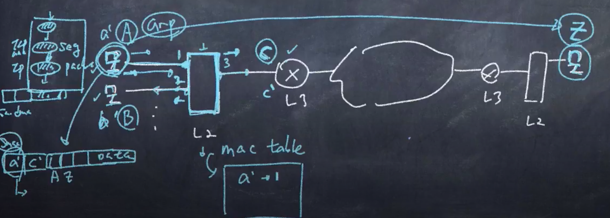

# L2 Switch
## 동작 원리
1. 자신의 Interface로 들어오는 Frame을 받아 Dmac 정보 확인
1. `자신의 Mac-addr table을 확인`
1. 내보내야할 Interface 결정 및 LookUp
1. Forwarding

## Mac-Address Table Create/Update
-  learning forwarding, flooding을 통해 mac-address table을 CU
### 과정
1. 1,2번 Input Port, 3번 Output Port
1. 최종 목표 Z
1. Mac Address Table이 비었을 때에는
1. source Mac을 보고 들어온 Interface와 Mapping하여 Mac Table을 채우고
1.  나에게 넘어온 Interface 외의 모든 Inteface에 Frame을 전달한다.
1. 1에서 들어왔을 때, 테이블이 비었다면 2로도 가고 L3로도 가게 된다.

# L3 Router
- `서로 다른 네트워크` 연결
## 동작 원리
1. 다양한 L2,L1 Protocol, Interface Type 제공
1. Frame에서 L2헤더를 떼고, IP의 DIP정보를 통해 Routing Table을 확인
1. Nexthop IP와 내보내야 할 Interface 결정
1. L2헤더 추가하여 Forwarding 